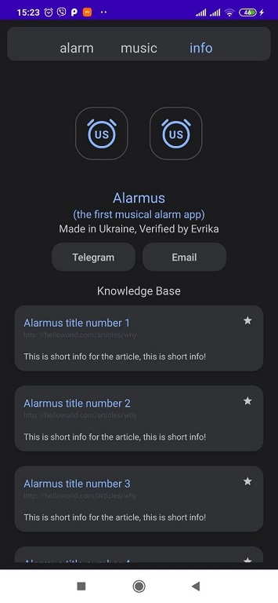
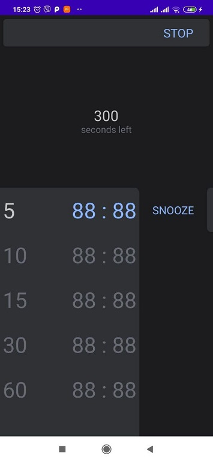

# Alarmus
### The first musical alarm clock or "the alarm clock of a healthy person"

## More detailed information
### [Information page](https://telegra.ph/Alarmus-06-07)

## Features
* Comfortable user interface for setting alarm and manipulating settings
* Setting gradually increasing mode for (15s, 30s, 45s, 60s)
* Variety of alarm modes (Only sound, only vibrations, both and without vibration and sound)
* Uploading music from inner storage, searching particular song funtionality
* Exciting articles about latest sleep research studies and how to improve sleeping quality
* Adjusting music volume power when playing
* Snoozing options for (5min, 10min, 15min, 30min)

## Technology stack (+ libs)
1. Java + Android SDK
2. Gradle

### Additionally
1. Google.android.material design
2. Gson
3. JUnit
4. Espresso

## Download apk 

## Screenshots

  

  

